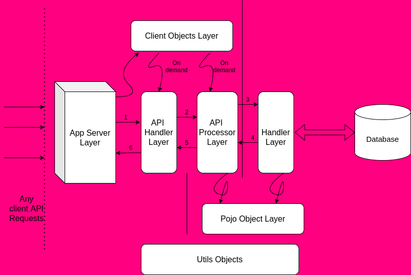
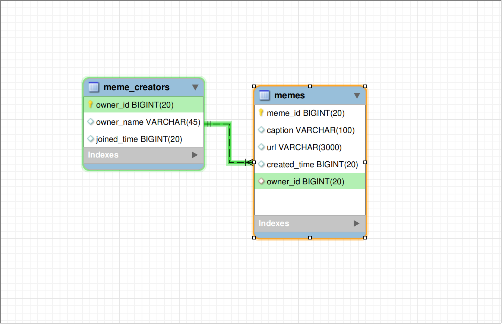

# Architecture

Here we can learn about the basic architeture of flow of data.

Contents

- [Backend](#backend)
    - [Java Code Base](#java-code-base)
        - [API Handler Layer](#api-handler-layer)
        - [API Processor Layer](#api-processor-layer)
        - [Handler Layer or DB Handler Layer](#handler-layer-or-db-handler-layer)
        - [Common Layers](#common-layers)
            - [Utils Object Layer](#utils-object-layer)
            - [POJO Layer](#pojo-layer)
            - [Client Object Layer](#client-object-layer)
    - [MySQL Schema](#mysql-schema)
    - [Table Meme Creators](#table-meme-creators)
    - [Table Memes](#table-memes)


# Backend

The below image will tell how the data comes from client is passed to the various layers in the backend.



## Java Code Base
First and foremost once the request hit the tomcat server in Jersey it will be passed to the  API Handle Layer (in our case com.xmeme.api.handler package files). We might have mentioned about this in web.xml

```xml

<servlet>
        <servlet-name>XMemeAPI</servlet-name>
        <servlet-class>org.glassfish.jersey.servlet.ServletContainer</servlet-class>

        <init-param>
            <param-name>jersey.config.server.provider.packages</param-name>
            <param-value>com.xmeme.api.handler</param-value>
        </init-param>
        <load-on-startup>1</load-on-startup>
    </servlet>

    <servlet-mapping>
        <servlet-name>XMemeAPI</servlet-name>
        <url-pattern>/memes/*</url-pattern>
    </servlet-mapping>
```

### API Handler Layer

Then next step once it reaches the specified API file, since in our case we have only class (MemeAPI.java) and its Path is "" then all the API with /memes/* will goto this class only.

In case if we have another set of API like /memes/9gag/* then we have another class (MemeAPI2.java) and if its path is "9gag" then all group of API /memes/9gag/* will goto this class, and others in other class.

This API handler Layer will be getting the Converted Object from client. Take a look at below example

```java

@POST
    @Consumes(MediaType.APPLICATION_JSON)
    @Produces(MediaType.APPLICATION_JSON)
    public Response createMems(ClientMeme clientClientMeme) {
        return new MemeAPIHandler().createMeme(clientClientMeme);
    }

```

Here we are have unannoted parameter (clientClientMeme). Whenever POST requests like /memes comes with the POST BODY data which comes as JSONObject will be first passed to *ClientMeme* java class. Example below

```json
{
 "name":"viswa",
 "url":"https://img-9gag-fun.9cache.com/photo/aeA610W_700bwp.webp",
 "caption" : "9 gag 1"
}
```

The JSONObject will be automatically set to name variable in the ClientMeme, similarly for url, caption it will set.

### API Processor Layer

From the API Handler Layer, next the call is made to API Processor Layer (in our class the package is com.xmeme.api.processor). If we have more API's then we will be adding sub folders inside this package and divide accordingly. One of the example is  below

```java
new MemeAPIHandler().createMeme(clientClientMeme);
```

In this layer, we will be invoking other layers and get it done. For example for this API we will be 

- validating the input
- creating the Pojo classes (by contacting with Pojo Object Layer)
- creating the Memecreator (by contacting with Handler Layer)
- Validate the MemeCreator objects (by contacting with Utils Object Layer)
- creating the memes (by connacting with Handler Layer)
- Sending response back to API Handler Layer to send it to client


### Handler Layer or DB Handler Layer

This is the layer where API Processor Layer sends the object for processing with the Data Layer. Data Layer can be anything like SQL Database (like MySQL), Cache (like Redis) or so on. We will be getting the Pojo Object  from API Processor Layer and we will save it in Database. We will get data from the Database and return as POJO objects to API Processor.


### Common Layers

There are some of the layers which will be commonly used by more than one Layers.


#### Utils Object Layer

This layer will be used by all the other layers. We will be having common things like constants, object validator, loggers and so on. 


#### POJO Layer

This layer will be used as the message passing layer between API Processor Layer and Handler Layer or DB Handler Layer. All the values set in the POJO objecs will be used for inserting into database, fetching from database, updating at database.


#### Client Object Layer

This layer will be used as the message passing layer between API Handler Layer and API Processor Layer. Usually the values for these objects are set mainly at client.

## MySQL Schema



The above diagram is the Schema how the database is designed for the backend.

Only two tables are present

- memes
- meme_creators

### Table Meme Creators

This table will have listing the list of all the creators details, like Name and joined time.

### Table Memes

This table will be having the list of details memes submit. Details like URL, submitted by author, caption, created time, and unique meme id.